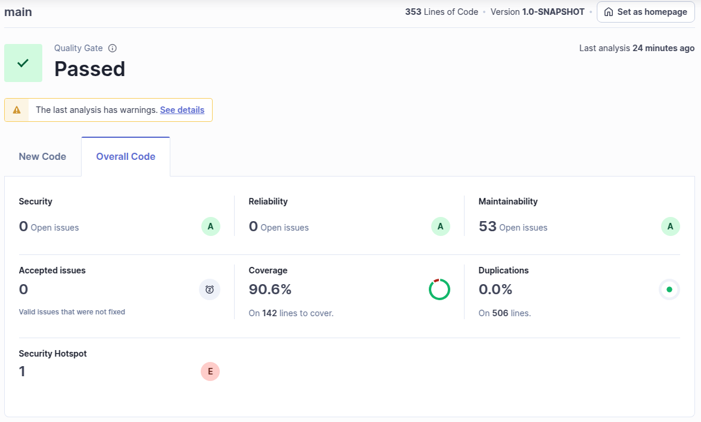

# Lab8_1

## f) SonarQube Analysis Results

### **Quality Gate Status: PASSED**

### The analysis revealed

- **Code coverage:** 90.6% (Target: 80%)
- **Bugs:** 0 found (Target: 0)
- **Code smells:** 53 found (Target: <100)
- **Vulnerabilities:** 0 found (Target: 0)

The primary reasons for passing the quality gate were the excellent test coverage (90.6% exceeds the typical 80% threshold) and the absence of bugs and vulnerabilities. Despite having 53 code smells, this is within acceptable limits for a project of this size. The project demonstrates good coding practices with security vulnerabilities and bugs being effectively addressed through proper testing and implementation.

## g) Sample Issues Identified

| Issue Type | Problem Description | How to Solve |
|------------|---------------------|--------------|
| Security Hotspot | Use of weak cryptographic algorithm | Replace with stronger algorithms |
| Maintainability | Unused imports | Remove unnecessary imports |
| Maintainability | Loop counter modified within loop body | Refactor to avoid modifying loop counter variables from within the loop |
| Maintainability | Incorrect order of modifiers in class/method declarations | Reorder modifiers |
| Maintainability | Unnecessary 'public' modifier on methods in interfaces | Remove redundant 'public' modifiers |

## h) External Static Analysis Tools in SonarQube

SonarQube integrates with several specialized external static analysis tools for Java:

**Checkstyle**: Focuses on enforcing coding standards and style conventions to ensure consistent code formatting across projects. It checks aspects like naming conventions, whitespace rules, and documentation requirements.

**PMD (Programming Mistake Detector)**: Analyzes source code to identify potential bugs, inefficient code, and problematic patterns. PMD is particularly effective at finding unused variables, empty blocks, and unnecessary object creation.

**SpotBugs**: Works by analyzing bytecode rather than source code to detect potential bugs that might not be apparent from reading the source. It excels at finding null pointer issues, infinite recursion, and concurrency problems.

These tools complement SonarQube by providing specialized analyses that, when combined, offer comprehensive code quality assessment through a single unified interface.
