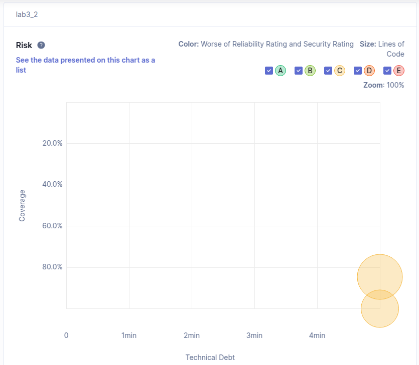
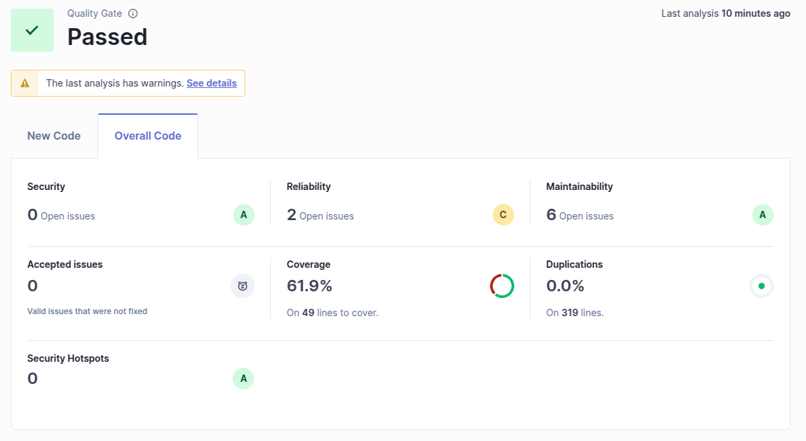

# SonarQube Analysis of Cars Project

## c) Technical Debt Analysis

### Analysis of Technical Debt Chart

### **Technical Debt**

- **Definition**: Technical debt refers to the estimated time required to fix all maintainability issues in the codebase. It is expressed in terms of time (e.g., minutes, hours, or days).
- **Reported Value**: The chart shows two clusters of issues with varying levels of **coverage** and **technical debt**:
  - **Coverage**: Indicates the percentage of code covered by tests.
  - **Technical Debt**: Indicates the time required to address maintainability issues.

### **Explanation of the Chart**

- **Coverage**: The chart shows that the project has **high test coverage** (above 80%), which is a positive indicator for code quality.
- **Technical Debt**: The technical debt is represented on the x-axis in terms of time (e.g., 1 min, 2 min, etc.). The clusters indicate areas of the code with higher debt.

### **Key Observations**

1. **High Coverage**: The project has good test coverage, which ensures that most of the code is tested and reduces the risk of undetected bugs.
2. **Technical Debt**: The technical debt is relatively low (around 4 minutes for the largest cluster), which suggests that the codebase is maintainable with only minor improvements needed.

### **Recommendations**

- **Focus on Maintainability**: Address the maintainability issues contributing to the technical debt. These could include code smells, duplicated code, or overly complex methods.
- **Continuous Improvement**: Regularly monitor and reduce technical debt to maintain a clean and maintainable codebase.

## d) SonarQube Dashboard Coverage Analysis

### **Coverage Metrics**

- **Overall Coverage**: 61.9% (considered moderate coverage)
- **Lines Covered**: Out of 49 total lines of code, approximately 19 lines are not covered by tests
- **Duplication**: 0.0% duplication across 319 lines, which is excellent

### **Quality Assessment**

- **Coverage Quality**: The coverage rate of 61.9% is acceptable but below industry best practices (typically 80%+)
- **Areas of Concern**: 
  1. The remaining 38.1% of uncovered code may hide potential bugs or errors
  2. While the dashboard shows a "Passed" quality gate, the coverage rating could be improved

### **Context Comparison**

- **Industry Standards**: Many organizations aim for 70-80% code coverage
- **Project Context**: For a small project like this Cars API, 61.9% provides reasonable assurance but leaves room for improvement

### **Recommendations**

1. **Increase Test Coverage**: Write additional tests to cover the remaining 19 lines
2. **Focus on Critical Paths**: Prioritize testing business-critical functionality
3. **Integration Testing**: Ensure API endpoints are thoroughly tested with various inputs
4. **Edge Cases**: Add tests for boundary conditions and error handling scenarios

The current coverage is adequate but should be improved to reduce potential risks in the codebase. The absence of duplications (0.0%) demonstrates good coding practices in terms of DRY (Don't Repeat Yourself) principles.
